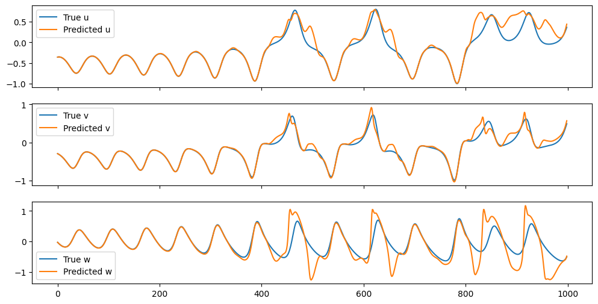

# PIRPy

**P**hysics-**I**nformed plug-in for **R**eservoir**Py** is a simple Python package that allows users to improve their Echo State Networks with physical knowledge. The package is designed to be used in conjunction with [ReservoirPy](https://github.com/reservoirpy/reservoirpy).

The package is currently under development by [SUPPRESS Research Group](https://suppress.unileon.es/en/), from [Universidad de León](https://www.unileon.es/).

## How it works
The Lorentz system is a well-known chaotic system with the following differential equations:

```math
\dot{u} = \sigma(v - u) \\
\dot{v} = u(\rho - w) - v \\
\dot{w} = uv - \beta w \\
```

With $\sigma = 10$, $\rho = 28$ and $\beta = 8/3$, sampling every $dt = 0.01$, we can generate the following time series:


We can split this time series into 3 parts: training, testing and prediction. The training part is used to train the ESN, the testing part is used to validate the ESN and the prediction part is used to improve the ESN with the PIRPy package.

The data preparation (splitting and normalization) will be omitted in the code examples for brevity.

### Training and testing an ESN
Using the first 1000 samples of the time series, we can train an ESN to forecast the Lorenz system. We can also test it with the next 1000 samples:

```python
# Model definition
res = Reservoir(units=100, sr=0.99, rc_connectivity=0.02, input_scaling=0.1, seed=666)
ridge = Ridge(ridge=1e-6)
res <<= ridge # Feedback connection
esn = res >> ridge

# Training
esn.fit(X_train, y_train, warmup=10)

# Warmup with the last training samples
esn.run(X_train[-100:])

# Testing the model
y_hat = esn.run(X_test)
```
This results in the following prediction with a Root Mean Squared Error (RMSE) of 0.211:



### Improving the ESN with PIRPy
We know that our system follows some specific differential equations:

```python
def lorenz_dyn(t, x):
    u, v, w = x

    dx = np.zeros_like(x)
    dx[0] = 10 * (v - u)
    dx[1] = u * (28 - w) - v
    dx[2] = u * v - 8/3 * w

    return dx
```

We can use this information to improve our ESN with PIRPy, using the last 1000 samples of the time series for this second training:

```python
add_knowledge(esn, scaler, dt, lorenz_dyn, X_pred, y_pred, warmup=100, maxiter=10)
```
We obtain the following output:

```console
STATUS: [Start][2025-02-22 17:18:29.883466] Loss: 30.57091233632922
STATUS: [Niter 1][2025-02-22 17:22:33.758153] Loss: 28.409467782737224
STATUS: [Niter 2][2025-02-22 17:28:41.709477] Loss: 27.587578647736418
STATUS: [Niter 3][2025-02-22 17:38:52.118410] Loss: 17.000514062067587
STATUS: [Niter 4][2025-02-22 17:39:54.061510] Loss: 16.064916621978764
STATUS: [Niter 5][2025-02-22 17:40:54.413194] Loss: 10.492729865649931
STATUS: [Niter 6][2025-02-22 17:43:54.033804] Loss: 8.532234145149474
STATUS: [Niter 7][2025-02-22 17:46:54.033010] Loss: 8.523255426439947
STATUS: [Niter 8][2025-02-22 17:47:54.122953] Loss: 8.403493863748494
STATUS: [Niter 9][2025-02-22 17:48:54.953815] Loss: 8.379374701250628
STATUS: [Niter 10][2025-02-22 17:49:52.296845] Loss: 8.32942098815868
STATUS: [End][2025-02-22 17:49:52.298349] Loss: 8.32942098815868 - [2025-02-22 17:49:52.298349]
```

And the following predictions on the test set, with a RMSE of 0.124:


# Advanced usage
The main function of the package is `add_knowledge`, which simply optimizes a `objective` function using `scipy.optimize.minimize`. This `objective` function is also available to the users, in case they want to optimize it with different methods than those available using `scipy.optimize.minimize`. 
The `objective` function implements the algorithm presented in [Physics-informed echo state networks](https://doi.org/10.1016/j.jocs.2020.101237).

In some cases we only have partial knowledge of the system, that is, we know only some of the differential equations that govern the system. This scenario is also supported by the package, defining system dynamics as follows:

```python
def partial_lorenz_dyn(t, x):
    u, v, w = x

    dx = np.zeros_like(x)
    dx[0] = 10 * (v - u)
    dx[1] = None # We don't know this equation but we will try to optimize predictions using the other two
    dx[2] = u * v - 8/3 * w

    return dx
```